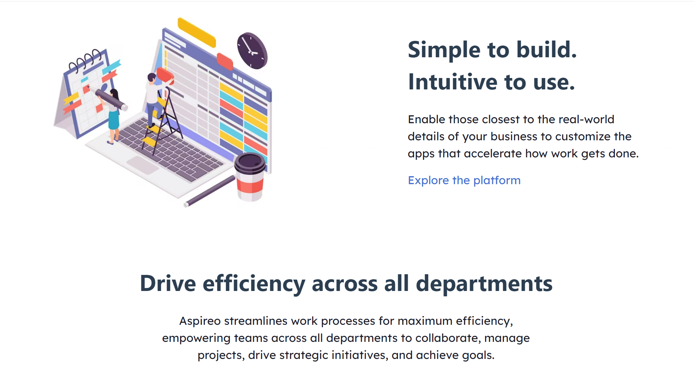
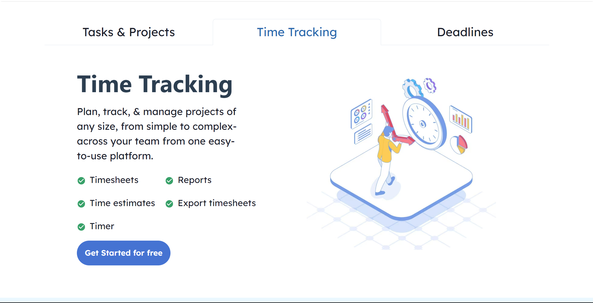
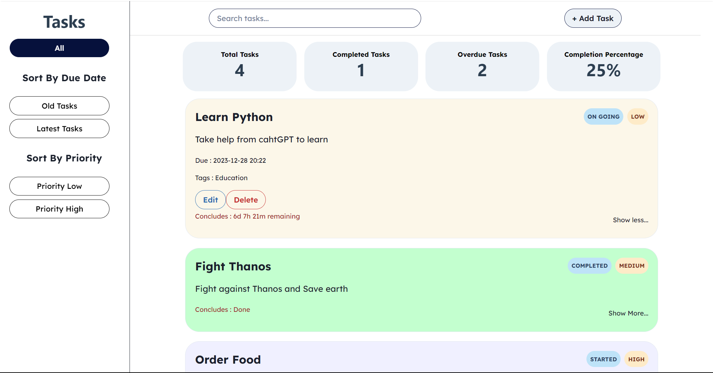
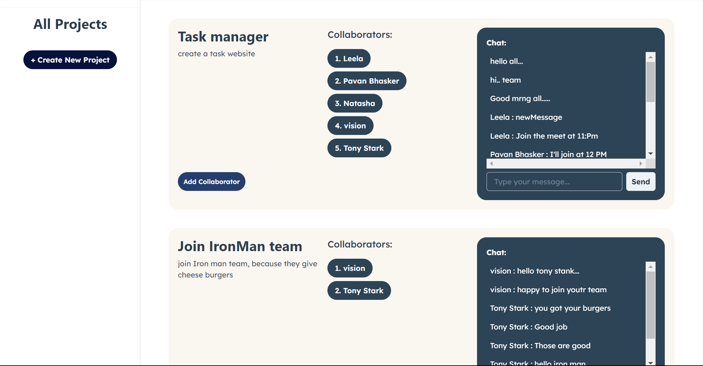
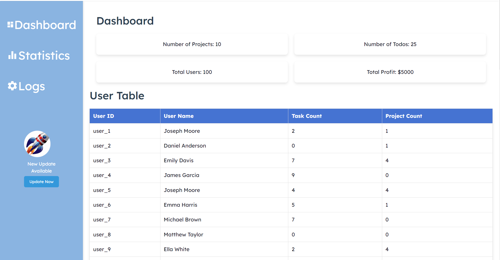

# smart-city-pulse-8901

# Aspireo - Task and Project Management Application

Welcome to Aspireo, your go-to platform for efficient task and project management. Aspireo is designed to streamline your workflow, enabling seamless collaboration on projects and ensuring timely completion of tasks. Below is a detailed overview of the features, functionality, and technology stack of Aspireo.

# Deployed Link:
https://aspireo.vercel.app/

# Overview

Aspireo is a comprehensive task and project management application that empowers teams and individuals to organize, collaborate, and succeed. The platform is equipped with intuitive tools to handle tasks with deadlines and foster communication among project contributors through a built-in chat feature.

# Key Features

User Authentication

Secure and user-friendly login and sign-up functionality using JSON Web Tokens (jsonwebtoken).
Protect your account and data with a robust authentication system.
Task Management

Create and manage tasks efficiently.
Set deadlines for tasks to prioritize and schedule work.
Flexibility to make changes to task details as needed.
Project Collaboration

Initiate and oversee projects with ease.
Foster collaboration among project contributors through a dedicated chat feature.
Keep communication centralized within the platform.
Admin Panel

Access administrative features to manage users, projects, and tasks.
Ensure smooth operation and oversight of the entire platform.
Screenshots

# 1. Home Page

# 2. Task Management

# 3. Project Chat

# 4. Login Page

# 5. Admin Panel

Technology Stack
Aspireo is built using a modern and powerful technology stack to ensure a robust and responsive user experience.

# Frontend:

React
Chakra UI
Bootstrap

# Backend:

Node.js
Express.js

# Database:

MongoDB
Getting Started
To run Aspireo locally, follow these steps:

Clone the repository: git clone https://github.com/your-username/aspireo.git
Install dependencies: cd aspireo && npm install
Start the server: npm start
Open your browser and navigate to http://localhost:3000
Ensure you have MongoDB installed and running for the full functionality of Aspireo.

Contribution
Contributions are welcome! If you have ideas for improvements or new features, feel free to open an issue or submit a pull request.

Thank you for choosing Aspireo for your task and project management needs. Happy collaborating!
